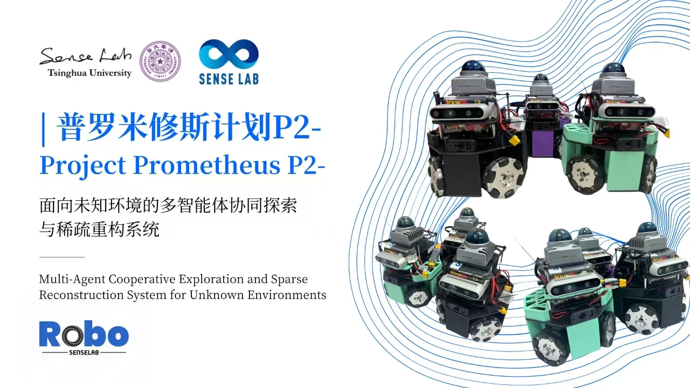
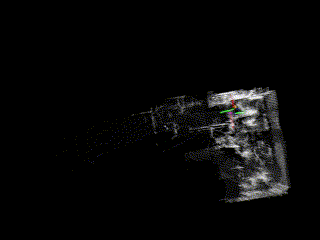

# SenseBeetle



SenseBeetle is a multi-Agent cooperative exploration and sparse reconstruction system for unknown environments, which needs to be used with the [SenseServer](https://github.com/senselabrobo/SenseServer). The code is based on [FAST_LIO](https://github.com/hku-mars/FAST_LIO) and [Autonomous Exploration Development Environment](https://github.com/HongbiaoZ/autonomous_exploration_development_environment), and adapted to the ROS2 environment and Livox mid 360 lidar.

<div align=center></div>

## Download

```bash
cd ~/
git clone https://github.com/senselabrobo/SenseBeetle
```

## Installation

### Mid 360 Driver

```bash
cd ~/
git clone https://github.com/Livox-SDK/Livox-SDK2.git
cd ./Livox-SDK2/
mkdir build
cd build
cmake .. && make -j
sudo make install
```

Open the file ~/SenseBeetle/src/livox_ros_driver2/src/config/MID360_config.json. Modify the cmd_data_ip, push_msg_ip, point_data_ip, imu_data_ip to be the lidar wired network port IP. Modify the lidar_configs to be 192.168.1.1xx，and xx to be the last two SN of lidar.

### Realsense Driver

```bash
sudo apt update
sudo apt install ros-humble-librealsense2* ros-humble-realsense2-* -y
```

### Dependencies

```bash
cd ~/SenseBeetle
sudo apt update
sudo apt install ros-humble-desktop-full python3-rosdep libgflags-dev libgoogle-glog-dev ros-humble-pcl* -y
sudo rosdep init
rosdep update
rosdep install -r --from-paths src --ignore-src --rosdistro $ROS_DISTRO -y
```

## Configuration

Be sure to turn off the firewall before running the code.

Open the file ~/SenseBeetle/src/multi_transform/launch/multi_transform.launch.py and modify the network_ip to be the server ip, and network_port to be the server port.

If multiple robots are started at the same time, set offset coordinates for robots with ids other than 0 to achieve global point cloud registration. Modify the six parameters prefixed with multi in the above configuration file, which represent the offset of the robot relative to the robot_0 robot.

## Build

```bash
bash ~/SenseBeetle/toBuild.sh
```

## Run

Replace [robot_id] with the id of the current robot (currently supported range is 0-4), and enter 0 if you want to start a single machine.

```bash
bash ~/SenseBeetle/run.sh [robot_id]
```